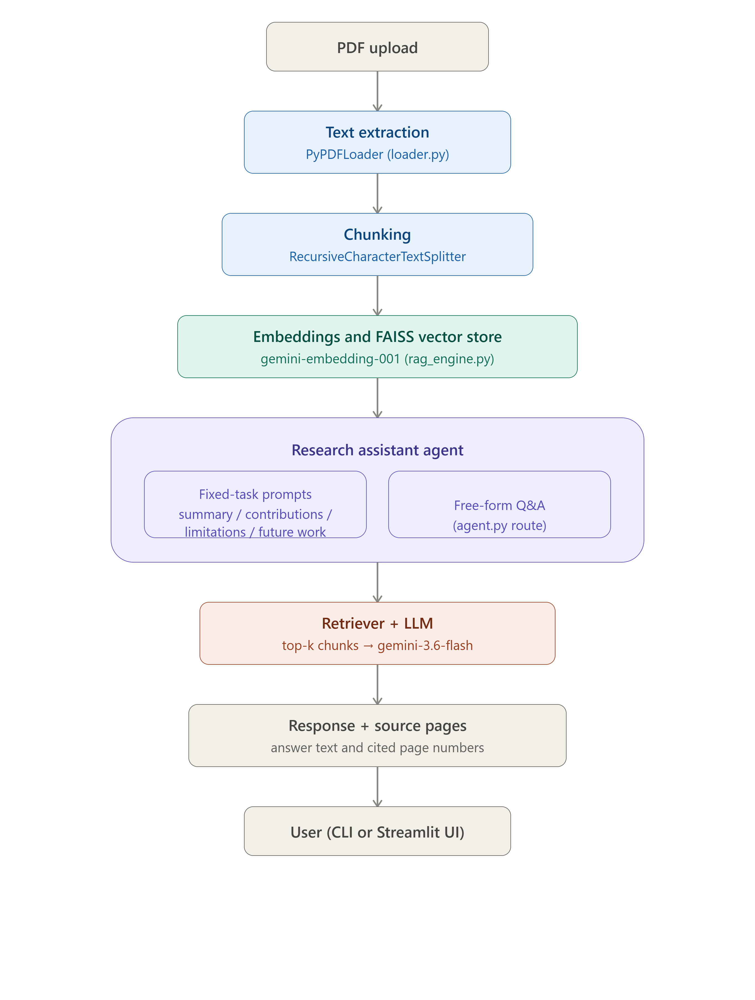

# 📄 Research Paper Assistant

A GenAI-powered assistant that reads a research paper PDF and answers questions
about it using Retrieval-Augmented Generation (RAG). Generate an instant summary,
key contributions, limitations, and future work — or ask free-form follow-up
questions with page-level source citations.

## Features

- **PDF ingestion** — upload any research paper PDF
- **RAG-based Q&A** — ask any question, get answers grounded in the actual paper
  content with cited source pages
- **Fixed-task prompts** — one-click summary, key contributions, limitations,
  and future work
- **Two interfaces** — command-line (CLI) or a Streamlit web UI

## Tech Stack

- Python
- Google Gemini API (`gemini-3.6-flash` for generation, `gemini-embedding-001`
  for embeddings)
- LangChain (RAG orchestration)
- FAISS (vector store)
- Streamlit (web UI)

## Setup

1. **Clone the repo**
```bash
   git clone https://github.com/Mohini-05-tech/Research-Paper-Assistant.git
   cd Research-Paper-Assistant
```

2. **Create a virtual environment**
```bash
   python -m venv venv
   venv\Scripts\activate      # Windows
   # source venv/bin/activate  # Mac/Linux
```

3. **Install dependencies**
```bash
   pip install -r requirements.txt
```

4. **Add your API key**
   Create a `.env` file in the project root:
   
   GOOGLE_API_KEY=your-gemini-api-key-here
   Get a free key at [aistudio.google.com/apikey](https://aistudio.google.com/apikey).

## Usage

**Command-line:**
```bash
python main.py
```
Enter the path to a PDF when prompted, then type `summary`, `contributions`,
`limitations`, `future work`, or any free-form question.

**Web UI:**
```bash
streamlit run app.py
```
Upload a PDF through the browser interface and use the buttons or the question box.

## Project Structure
\`\`\`
├── loader.py       # PDF loading and text extraction
├── rag_engine.py    # Chunking, embeddings, FAISS vector store, retrieval chain
├── prompts.py       # Fixed-task prompt templates
├── agent.py         # ResearchAssistant class — routes between tasks and Q&A
├── main.py          # CLI entry point
├── app.py           # Streamlit web UI
└── requirements.txt
\`\`\`

## Architecture

